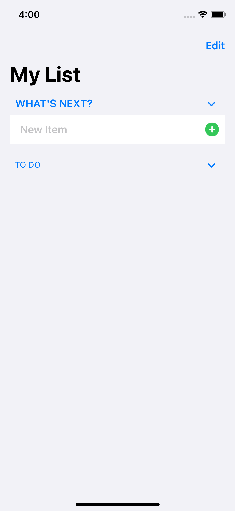
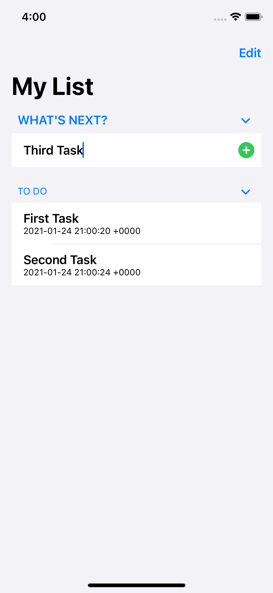
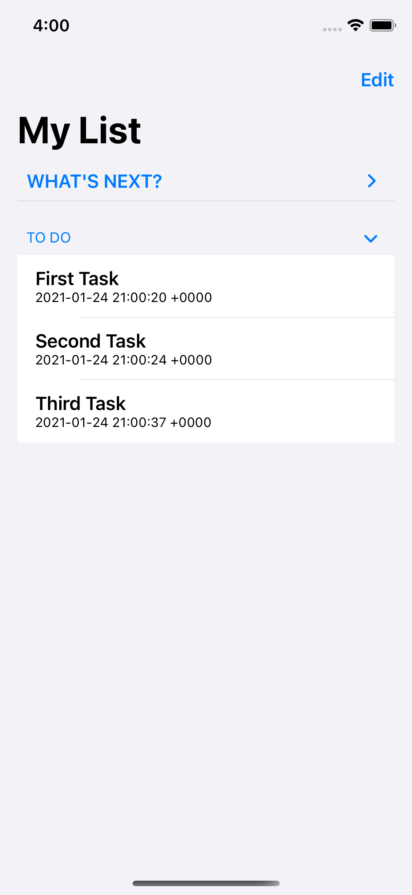
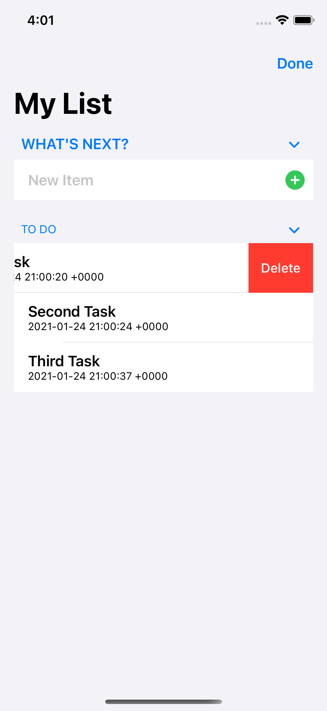

# Todo iOS Application
My first iOS Application, written in Swift and SwiftUI. Built with CoreData, designed to help plan one's busy day by offering ListView based functionality.

# Application in Use
Here are some screenshots of the application in action, highlighting some of its core features. Keep in mind this is my first Swift Application, so I decided to keep it relatively simple in order to get the hang of the basics.

|  Entering Application    | Entering Tasks            |  Viewing Tasks            | Managing Tasks
:-------------------------:|:-------------------------:|:-------------------------:|:-------------------------:
  |  |  | 

Notice the application on the third screenshot, where each HStack title and sublist is collapsable. That way, once one is finished entering all their tasks (or finished with their tasks for that matter), they can easily collapse whichever submenu they are finished with, so they can focus on the other portion of the app. It also gives the app a cleaner aesthetic. 

# Dependencies Utilized
- Swift
- SwiftUI
- CoreData
